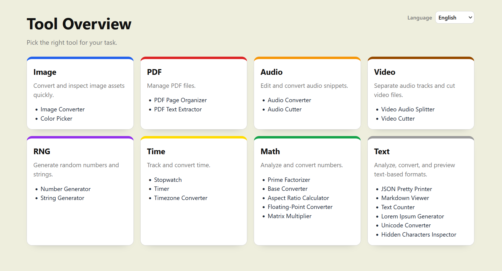

# Tools

A collection of small browser-based utility tools, written in TypeScript with Vite.

- Home dashboard, category pages and tool subpages
- English and German interface
- Desktop and mobile browser support

Everything runs locally in the browser without any file uploads or server-side processing.
Only the language and a few tool preferences are kept in the local storage.

**Live:** https://vinwun.github.io/tools/



## Tools

- `Image Tools`:
  - `Image Converter`: image conversion into `png` / `jpg` / `webp`
  - `Color Picker`: color field and Hex / RGB / HSL sync with copy-on-click
- `PDF Tools`:
  - `PDF Page Organizer`: merge PDFs, move pages, extract pages / ranges
  - `PDF Text Extractor`: extract text from PDF documents as .md or .txt
- `Audio Tools`:
  - `Audio Converter`: audio conversion into `wav`
  - `Audio Cutter`: audio cutter with keep/remove mode and `wav` download
- `Video Tools`:
  - `Video Audio Splitter`: extract the audio track or strip it from videos
  - `Video Cutter`: video cutter on keyframe boundaries
- `RNG Tools`:
  - `Number Generator`: random numbers in a min/max range with integer / decimal mode
  - `String Generator`: pick from a list of strings with optional per-entry weights and unique mode
- `Time Tools`:
  - `Stopwatch`: measure elapsed time with lap controls
  - `Timer`: count down from a duration with completion alert
  - `Timezone Converter`: convert times between different time zones
- `Math Tools`:
  - `Prime Factorizer`: factor integers into primes with expanded and exponent forms
  - `Base Converter`: convert numbers between numeral systems
  - `Aspect Ratio Calculator`: convert width and height into aspect ratio and decimal
  - `Floating-Point Converter`: convert floating-point numbers and their bit representations
  - `Matrix Multiplier`: multiply two matrices
- `Text Tools`:
  - `JSON Pretty Printer`: validate and pretty-print JSON with a collapsible preview and download
  - `Markdown Viewer`: display Markdown and download as HTML
  - `Text Counter`: count words, characters, and other statistics of a text
  - `Lorem Ipsum Generator`: generate placeholder text with a specific length
  - `Unicode Converter`: convert characters between code points and encodings
  - `Hidden Characters Inspector`: find zero-width, bidi, invisible space and confusable characters

## Development

Requires Node.js 22.12+ or 24+.

```sh
npm install
npm run dev      # dev server with hot reload
npm test         # unit tests (Vitest)
npm run build    # type check and production build into dist/
npm run preview  # serve the production build locally
```

## Architecture

- **Vanilla TypeScript.** Each tool is a small, self-contained page with a few inputs and outputs, so a framework is not needed.
- **Tool lifecycle.** Each tool holds resources only while it is open and releases everything when you leave. Heavy libraries (PDF) load on first use.
- **i18n.** All user-facing text lives in `src/i18n/locales` (`en`, `de`). A language switch only replaces the page chrome and asks the mounted tool to relabel itself.
- **Routing.** Client-side routing with the History API. On GitHub Pages, `public/404.html` redirects deep links back to `index.html`.

## License

[MIT](LICENSE) © vinwun

### Third-party libraries

| Library | Used for | License |
| --- | --- | --- |
| [pdf-lib](https://github.com/Hopding/pdf-lib) | PDF Page Organizer | MIT |
| [pdfjs-dist](https://github.com/mozilla/pdf.js) | PDF rendering and text extraction | Apache-2.0 |

The full license texts of all bundled dependencies are generated at build time and published at [third-party-licenses.md](https://vinwun.github.io/tools/third-party-licenses.md).
